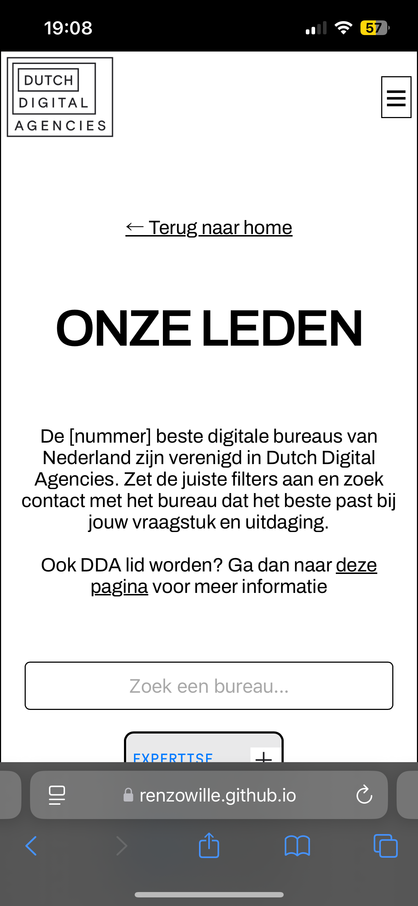
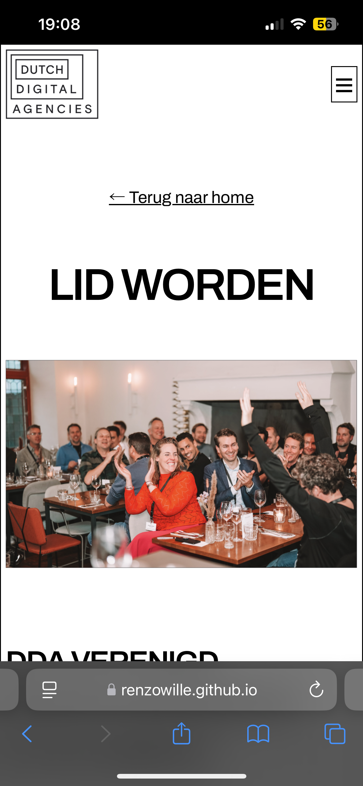
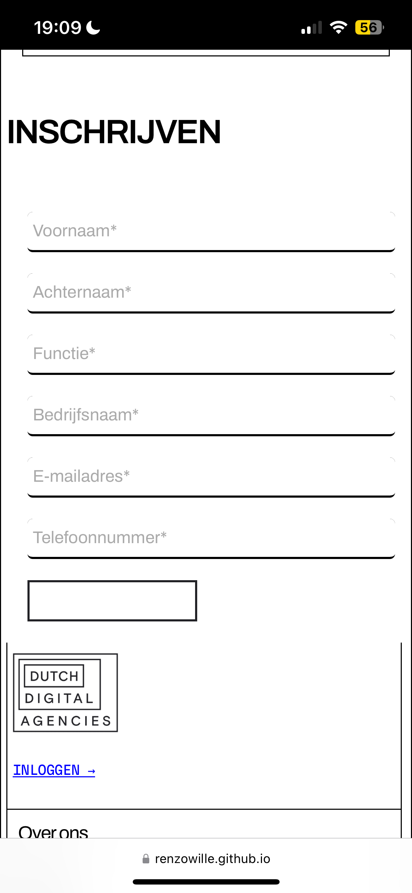
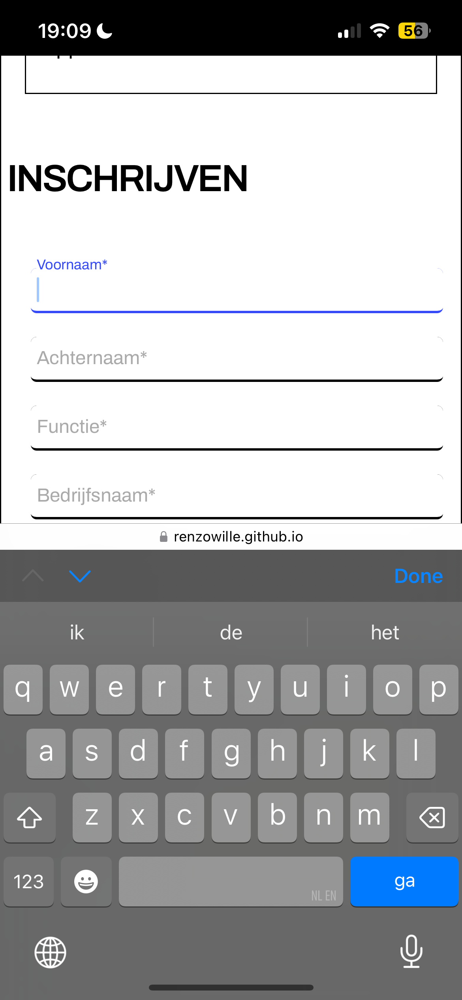
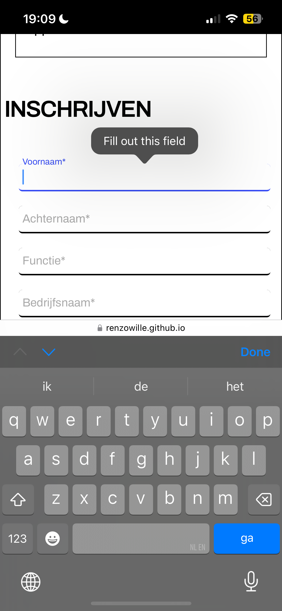

# Corporate Identity

Ontwerp en maak voor een opdrachtgever een website op basis van een bestaande huisstijl.

## Inhoudsopgave Readme

  * [Titel](#titel)
  * [Beschrijving](#beschrijving)
  * [Kenmerken](#kenmerken)
  * [Bronnen](#bronnen)
  * [Licentie](#licentie)

# Titel
Look & Feel Corporate Identity - DDA Agency Leden pagina & Lid worden pagina

## Beschrijving

De pagina laat de "leden" zien van DDA. Je krijgt hier de kans om te kunnen filteren op deze leden. De filter heb ik opnieuw getweaked met "select" element en deze filter zo goed mogelijk geprobeerd te stijlen als hoe deze op het ontwerp stond.

Ook heb ik er dus voor gezorgd dat er een detail pagina bij is gekomen. Op deze pagina kunnen bedrijven zich inschrijven om bij het DDA-netwerk te kunnen komen via het invullen van een formulier.

Alles is mobile-first geschreven en dus responsive gemaakt voor grotere schermen. Dit is de <a src="https://renzowille.github.io/look-and-feel-corporate-identity/">link</a> naar mijn ontwerp.

## Kenmerken

# HTML

Voor het schrijven van de filter heb ik dus select elementen gebruikt en geprobeerd deze zo goed mogelijk te stijlen. Omdat select elementen nog zo nieuw zijn heb ik met behulp van mijn docent ervoor kunnen zorgen dat de filter er zo goed mogelijk uit is gaan zien.

Voor het schrijven van het formulier heb ik typebox gebruikt om ervoor te zorgen dat bezoekers gegevens in kunnen vullen om deel uit te kunnen maken van het DDA-netwerk.

# CSS

Voor dit ontwerp is er gebruik gemaakt van een stylesheet die is gelinkt aan de code zodat ik efficienter te werk kan gaan om de code te schrijven.

Verder heb ik er ook voor gezorgd dat de bestanden aan elkaar gelinkt zijn zodat ik zo min mogelijk dubbele code hoeft te schrijven voor de detail pagina. Hierdoor blijft alle CSS overzichtelijk.

## Bronnen

https://open-ui.org/components/customizableselect/
https://www.filamentgroup.com/lab/select-css.html
https://developer.mozilla.org/en-US/docs/Web/SVG/Tutorial/SVG_In_HTML_Introduction
https://developer.mozilla.org/en-US/docs/Web/HTML/Element/form

## Licentie

This project is licensed under the terms of the [MIT license](./LICENSE).
